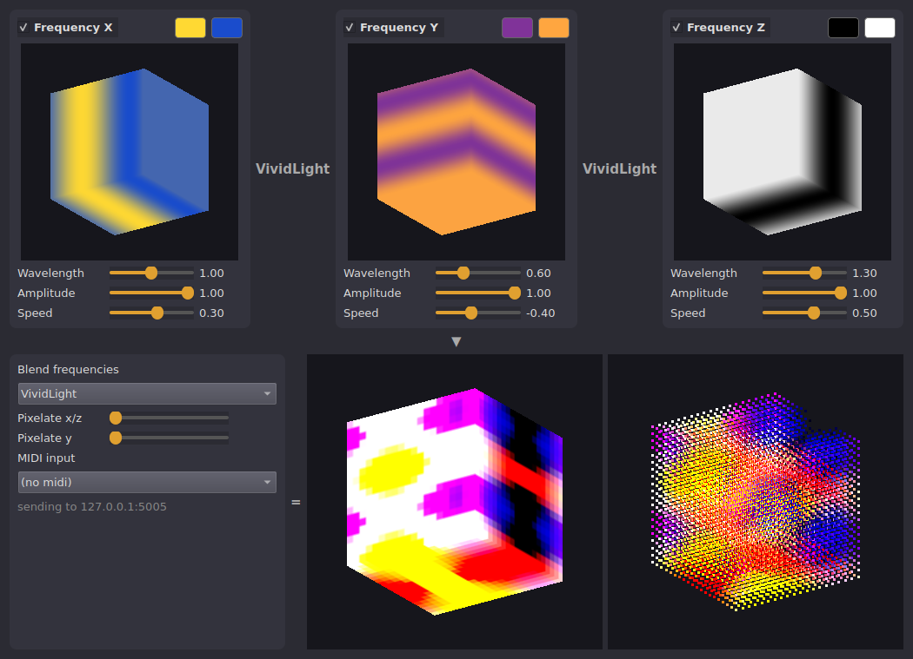

# Frequency composition

Mix three colour oscillations - one frequency per axis (x, y, z) - into a 3D light
pattern, and watch it live on the [VoxelBox](https://codeberg.org/VoxelBox/voxelbox)
or its simulator. Controllable with a Korg nanoKONTROL.



## Usage

Each frequency is a cosine wave along one axis of the 20x20x20 volume, fading between
two colours. The window shows each frequency as a box, the blend, and the result as a
continuous box and as the actual leds. Drag any 3D view to rotate all of them.

- **Wavelength, Amplitude, Speed** per frequency, plus its two colours
- **Blend**: how the three frequencies are combined (Multiply, Add, Screen, ...)
- **Pixelate** x/z and y: block size in leds

The result is sent via UDP (20*20*20*3 bytes) 30 times a second.

## Run

```
python -m venv .venv && . .venv/bin/activate    # on Debian/Ubuntu: apt install python3-venv, or use `uv venv`
pip install -r requirements.txt                   # or: uv pip install -r requirements.txt
python frequency_composition.py [--host 127.0.0.1] [--port 5005] [--midi nanokontrol]
```

`--host` is the VoxelBox, or the machine running the simulator. `--midi` is part of the
name of the MIDI input to open automatically; it can also be picked in the window.

## MIDI

Edit the `CC` dictionary at the top of `frequency_composition.py`. Defaults:

| Control                        | CC         |
|--------------------------------|------------|
| Frequency X (wavelength, amplitude, speed) | knobs 14, 15, 16 |
| Frequency Y                    | knobs 17, 18, 19 |
| Frequency Z                    | faders 2, 3, 4 |
| Pixelate x/z, y                | knobs 21, 22 |
